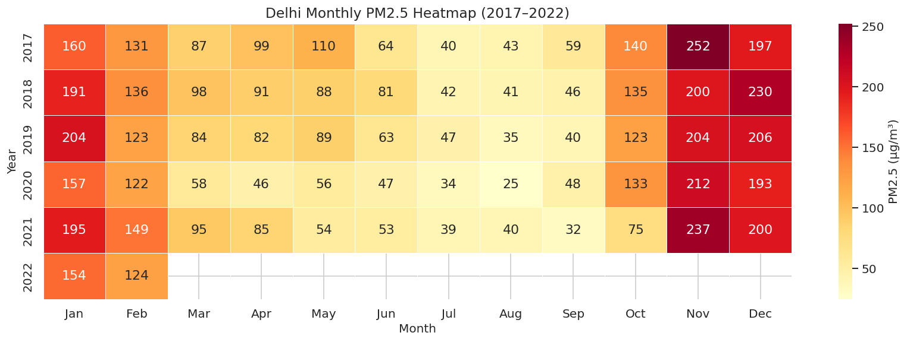

# India Air Quality Analysis (2017–2022)

Exploratory Data Analysis of PM2.5 Pollution, Temporal Trends, Population Dynamics, and NCAP Policy Insights


---

## Project Overview

This project presents an exploratory data analysis of PM2.5 concentrations across India using more than one million air quality observations collected from 561 CPCB monitoring stations between 2017 and 2022.

The analysis investigates spatial and temporal pollution patterns, seasonal behaviour, population–pollution relationships, monitoring infrastructure, and trends associated with the National Clean Air Programme (NCAP).

The notebook demonstrates practical applications of data cleaning, exploratory analysis, statistical aggregation, and visualization using Python.

---

## Objectives

- Analyse state-wise PM2.5 concentrations across India.
- Identify hazardous pollution episodes and pollution hotspots.
- Study seasonal and long-term pollution trends.
- Compare pollution patterns across monitoring stations and cities.
- Examine relationships between population, monitoring coverage, and pollution.
- Explore NCAP funding alongside air quality indicators.
- Generate insights through exploratory data analysis.

---

## Dataset

| Dataset | Description |
|---------|-------------|
| **Data.csv** | Daily PM2.5 and PM10 observations collected from CPCB monitoring stations (2017–2022). |
| **NCAP_Funding.csv** | State and city-wise funding released under the National Clean Air Programme. |
| **State_data.csv** | Population and geographic area of Indian states used for demographic analysis. |

### Dataset Summary

- **1,048,575+** observations
- **561** monitoring stations
- **31** states and union territories
- **2017–2022** study period

---

## Analyses Performed

### State-wise Air Pollution Analysis

- Average PM2.5 concentration by state
- Hazardous air quality days (PM2.5 > 300 µg/m³)
- PM2.5 variability using standard deviation
- Least polluted states during 2020–2021

### Station-level Analysis

- Highest recorded PM2.5 monitoring station
- Seasonal PM2.5 variation at Kalaburagi monitoring station
- Weekday vs. weekend pollution comparison

### Temporal Analysis

- Summer-to-monsoon PM2.5 changes
- Delhi monthly PM2.5 heatmap
- Delhi vs. Mumbai long-term PM2.5 comparison

### Population & Pollution Analysis

- Population served per monitoring station
- Per-capita PM2.5 exposure
- Population density vs. PM2.5 relationship
- Maharashtra–Madhya Pradesh comparative analysis

### Geographic Analysis

- Area-normalized PM2.5 concentration
- Monitoring station density across states

### NCAP Policy Analysis

- Funded vs. non-funded state comparison
- Assam PM2.5 trend before and after NCAP
- Relationship between state area and NCAP funding

---

## Key Findings

- Delhi consistently records the highest PM2.5 concentrations among the analysed states.
- Winter months exhibit substantially higher pollution levels than the monsoon season across most regions.
- A noticeable reduction in PM2.5 concentrations is visible during the COVID-19 lockdown period.
- Population density alone does not explain air pollution patterns; industrial activity, geography, and meteorological conditions also contribute significantly.
- Monitoring infrastructure remains unevenly distributed across Indian states.
- States receiving NCAP funding generally correspond to historically more polluted regions, reflecting policy prioritization rather than policy impact alone.

---
## Sample Visualizations

### State-wise PM2.5 Concentration


### Delhi PM2.5 Heatmap



## Repository Structure

```
India-Air-Quality-Analysis/
│
├── India_Air_Quality_Analysis.ipynb
├── Data.csv
├── NCAP_Funding.csv
├── State_data.csv
├── README.md
├── requirements.txt
├── LICENSE
└── .gitignore
```

---

## Installation

Clone the repository.

```bash
git clone https://github.com/PravallikaMatha/India-Air-Quality-Analysis.git
cd India-Air-Quality-Analysis
```

Install the required dependencies.

```bash
pip install -r requirements.txt
```

Launch the notebook.

```bash
jupyter notebook India_Air_Quality_Analysis.ipynb
```

---

## Technical Stack

| Tool | Purpose |
|------|---------|
| Python | Programming language |
| Pandas | Data cleaning and analysis |
| NumPy | Numerical computation |
| Matplotlib | Data visualization |
| Seaborn | Statistical visualization |
| Jupyter Notebook | Interactive analysis environment |

---

## Limitations

- Dataset coverage extends only until 2022.
- Results represent monitoring station measurements and may not fully characterize entire cities or states.

---

## Future Work

- Interactive dashboards using Plotly or Streamlit
- Satellite-based PM2.5 analysis
- Machine learning models for PM2.5 forecasting
- Interactive geospatial visualizations
- Integration of meteorological variables for predictive analysis

---

## Data Sources

- Central Pollution Control Board (CPCB)
- Ministry of Environment, Forest and Climate Change (MoEFCC)
- Census of India

---

## License

This project is released under the MIT License.

---

## Author

**Pravallika Matha**

Mechanical Engineering Undergraduate  
Indian Institute of Technology Gandhinagar  
Indian Institute of Technology Gandhinagar
ngineering | IIT Gandhinagar*
